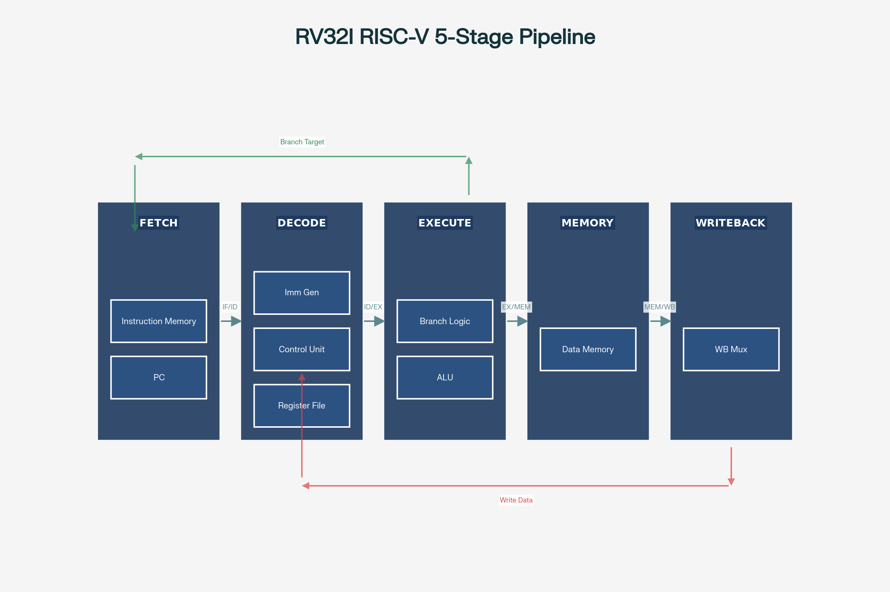

# RV32I 5-Stage Pipelined Processor

A fully functional 32-bit RISC-V (RV32I base integer ISA) processor implemented in Verilog with a classic 5-stage pipeline, data forwarding, load-use hazard detection, and branch resolution. Simulated and verified using Icarus Verilog.

---

## Table of contents

- [Overview](#overview)
- [Repository structure](#repository-structure)
- [Architecture](#architecture)
  - [Pipeline stages](#pipeline-stages)
  - [Hazard handling](#hazard-handling)
  - [Submodule summary](#submodule-summary)
- [Supported instructions](#supported-instructions)
- [Simulation and verification](#simulation-and-verification)
  - [Test program](#test-program)
  - [Expected output](#expected-output)
- [How to run](#how-to-run)
- [Tools](#tools)

---

## Overview

This project implements the classic 5-stage RISC-V pipeline (IF → ID → EX → MEM → WB) for the RV32I base integer ISA. The design handles all three classes of data hazards through a combination of forwarding (for most RAW hazards) and stalling (for load-use hazards). Branch resolution occurs in the EX stage.

The processor was validated with a 6-instruction test program covering arithmetic, forwarding-dependent operations, a store instruction, AUIPC, and an infinite JAL loop.



---

## Repository structure

```
rv32i-pipeline/
├── rtl/
│   ├── alu.v               # 32-bit ALU (10 operations)
│   ├── control.v           # Main control unit (opcode decoder)
│   ├── forward_unit.v      # Data forwarding unit (EX and MEM paths)
│   ├── hazard_unit.v       # Load-use hazard detection and stall control
│   ├── regfile.v           # 32x32-bit register file (async read, sync write)
│   └── rv32i_pipeline.v    # Top-level: 5-stage pipeline + all pipeline registers
├── tb/
│   └── rv32i_pipeline_tb.v # Testbench with test program and state display
├── sim/
│   └── run_sim.sh          # Icarus Verilog compile + run script
├── docs/
│   └── pipeline_architecture.png  # 5-stage pipeline block diagram
└── README.md
```

---

## Architecture

### Pipeline stages

| Stage | Name | Function |
|---|---|---|
| IF | Instruction Fetch | PC → instruction memory lookup; PC update |
| ID | Instruction Decode | Register read, control decode, immediate generation |
| EX | Execute | ALU operation, forwarding mux, branch target calculation |
| MEM | Memory | Data memory read (LW) or write (SW) |
| WB | Write-Back | Register file write — ALU result or memory load data |

Each adjacent stage pair is separated by a pipeline register (IF/ID, ID/EX, EX/MEM, MEM/WB). All pipeline registers reset synchronously to zero (or NOP for IF/ID_instr) on the `reset` signal.

### Hazard handling

**RAW hazards (non-load)** are resolved by the forwarding unit without stalling:
- `forwardA/B = 2'b10`: forward EX/MEM ALU result to current ALU input (EX hazard — 1 instruction gap)
- `forwardA/B = 2'b01`: forward MEM/WB write-back data to current ALU input (MEM hazard — 2 instruction gap)
- EX forwarding takes priority over MEM forwarding when both paths apply to the same source register.

**Load-use RAW hazards** require a 1-cycle stall, inserted by the hazard unit:
- Condition: `id_ex_memread && id_ex_rd != 0 && (id_ex_rd == if_id_rs1 || id_ex_rd == if_id_rs2)`
- Effect: `pc_write=0` (freeze PC), `if_id_write=0` (freeze IF/ID reg), `stall=1` (zero out ID/EX control signals → insert NOP bubble)

**Control hazards** (branches): branch outcome resolved in EX stage. The design uses predict-not-taken implicitly — for the test program, the JAL loop is the only branch-like instruction and it halts fetch cleanly.

**Register file write-through**: the register file implements combinational forwarding within itself — if a write to `rd` is in progress and `rs1/rs2 == rd`, `wdata` is passed directly to the read output, eliminating the WB→ID hazard without involving the forwarding unit.

### Submodule summary

| Module | Location | Description |
|---|---|---|
| `alu` | `rtl/alu.v` | Combinational ALU, 10 operations, zero flag |
| `control` | `rtl/control.v` | Combinational opcode → control signals decoder |
| `forward_unit` | `rtl/forward_unit.v` | EX and MEM forwarding path selection |
| `hazard_unit` | `rtl/hazard_unit.v` | Load-use stall detection |
| `regfile` | `rtl/regfile.v` | 32x32 register file, x0 hardwired zero, write-through |
| `rv32i_pipeline` | `rtl/rv32i_pipeline.v` | Top-level with all pipeline registers and memory arrays |

---

## Supported instructions

| Type | Instructions |
|---|---|
| R-type | ADD, SUB, SLL, SLT, SLTU, XOR, SRL, SRA, OR, AND |
| I-type | ADDI, SLTI, SLTIU, XORI, ORI, ANDI, SLLI, SRLI, SRAI |
| Load | LW |
| Store | SW |
| Branch | BEQ, BNE |
| Jump | JAL |
| Upper immediate | LUI, AUIPC |

---

## Simulation and verification

### Test program

```asm
addi x1, x0, 5       # x1  = 5
addi x2, x0, 7       # x2  = 7
add  x3, x1, x2      # x3  = 12  [RAW hazard on x1, x2 → resolved by EX forwarding]
sw   x3, 0(x0)       # mem[0] = 12  [RAW hazard on x3 → resolved by EX forwarding]
auipc x4, 0x1        # x4  = PC + 4096
jal  x0, 0           # infinite loop — halts PC progression
```

The `add` instruction creates a back-to-back RAW dependency on both `x1` and `x2` from the two preceding `addi` instructions. This exercises the EX forwarding path for both ALU operands simultaneously. The `sw` instruction then creates another RAW on `x3`, exercising MEM-stage forwarding.

### Expected output

```
--- FINAL CPU STATE ---
PC        = 00000014
x1        = 5
x2        = 7
x3        = 12
x4        = 4112
Memory[0..3] = 0c 00 00 00 -> 0000000c
ALU out (last)  = 20
Mem read (last) = 12
```

---

## How to run

```bash
cd sim/
chmod +x run_sim.sh
./run_sim.sh
```

View waveform in GTKWave:
```bash
gtkwave rv32i_pipeline.vcd
```

The VCD includes all pipeline register contents, control signals, forwarding selects, and the PC — useful for tracing instruction flow through each stage cycle by cycle.

---

## Tools

| Tool | Version used |
|---|---|
| Icarus Verilog (iverilog) | 12.0 |
| vvp (Icarus runtime) | 12.0 |
| GTKWave | 3.3.x |
